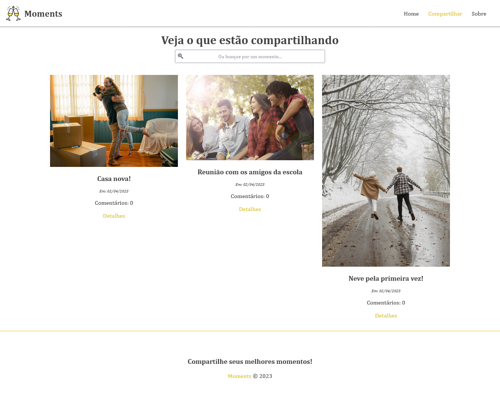

<p align="center">
  <a href="https://moments-project-pied.vercel.app/">
    
  </a>
</p>

<h1 align="center"> Projeto Moments </h1>

<p align="center">
  <a href="#Introducao"> 🧩 Introdução </a>&nbsp;&nbsp;&nbsp;|&nbsp;&nbsp;&nbsp;
  <a href="#Dependencias"> 🧪 Dependências</a>&nbsp;&nbsp;&nbsp;|&nbsp;&nbsp;&nbsp;
  <a href="#Aplicacao"> 🚀 Aplicação</a>&nbsp;&nbsp;&nbsp;|&nbsp;&nbsp;&nbsp;
  <a href="#Imagens"> 💻 Imagem do projeto</a>&nbsp;&nbsp;&nbsp;|&nbsp;&nbsp;&nbsp;
  <a href="#Scripts"> 📖 Scripts</a>&nbsp;&nbsp;&nbsp;&nbsp;&nbsp;&nbsp;
</p>

<a id="Introducao"></a>
## 🧩 Introdução

### Moments é um projeto fullstack que utiliza uma API construida em AdonisJS para o backend, sendo esse, um sistema que podemos compartilhar os momentos da nossa vida, parecido com o Instagram. Podemos fazer a busca por momentos, contendo páginas dinamicas que podem resgatar dados do banco de dados, realizar funções de CRUD nos momentos, flash messages, upload de imagens e a realização de comentários em cada postagem.

<a id="Dependencias"></a>
## 🧪 Dependencias
> Requisitos para rotar o codigo...

<ul>
  <li>
    <a href="https://nodejs.org/en">Node</a>
  </li>
  <li>
    <a href="https://www.npmjs.com/">npm</a>
  </li>
  <li>
    <a href="https://angular.io/">Angular</a>
  </li>
  <li>
    <a href="https://www.typescriptlang.org/">TypeScript</a>
  </li>
</ul>

<p>Para o back-end desse projeto, utilize a seguinte <a href="https://github.com/daviteixeira-btm/API-RESTful-com-AdonisJS">API</a>.</p>

<a id="Aplicacao"></a>
## 🚀 Aplicação

### Instalação e inicialização do projeto

### ```COMANDOS```

#### Para instalar as dependências
```
 npm install
```

#### Para rodar o projeto
```
 ng serve
```

<a id="Imagens"></a>
## 💻 Imagem do projeto

<div align="center">
  
</div>
<p align="center"><a href="https://moments-project-pied.vercel.app/">Ver projeto</a></p>

<a id="Scripts"></a>
## 📖 Scripts

```JSON
"scripts": {
  "ng": "ng",
  "start": "ng serve",
  "build": "ng build",
  "watch": "ng build --watch --configuration development",
  "test": "ng test"
}
```

### 📖 Dependencies 

```JSON
"dependencies": {
  "@angular/animations": "^15.1.0",
  "@angular/common": "^15.1.0",
  "@angular/compiler": "^15.1.0",
  "@angular/core": "^15.1.0",
  "@angular/forms": "^15.1.0",
  "@angular/platform-browser": "^15.1.0",
  "@angular/platform-browser-dynamic": "^15.1.0",
  "@angular/router": "^15.1.0",
  "@fortawesome/angular-fontawesome": "^0.12.1",
  "@fortawesome/fontawesome-svg-core": "^6.2.1",
  "@fortawesome/free-brands-svg-icons": "^6.2.1",
  "@fortawesome/free-regular-svg-icons": "^6.2.1",
  "@fortawesome/free-solid-svg-icons": "^6.2.1",
  "rxjs": "~7.8.0",
  "tslib": "^2.3.0",
  "zone.js": "~0.12.0"
}

```

### 📖 devDependencies

```JSON
"devDependencies": {
  "@angular-devkit/build-angular": "^15.1.5",
  "@angular/cli": "~15.1.5",
  "@angular/compiler-cli": "^15.1.0",
  "@types/jasmine": "~4.3.0",
  "jasmine-core": "~4.5.0",
  "karma": "~6.4.0",
  "karma-chrome-launcher": "~3.1.0",
  "karma-coverage": "~2.2.0",
  "karma-jasmine": "~5.1.0",
  "karma-jasmine-html-reporter": "~2.0.0",
  "typescript": "~4.9.4"
}

```

<p align="center">Feito com ❤️ por Davi Teixeira</p>
